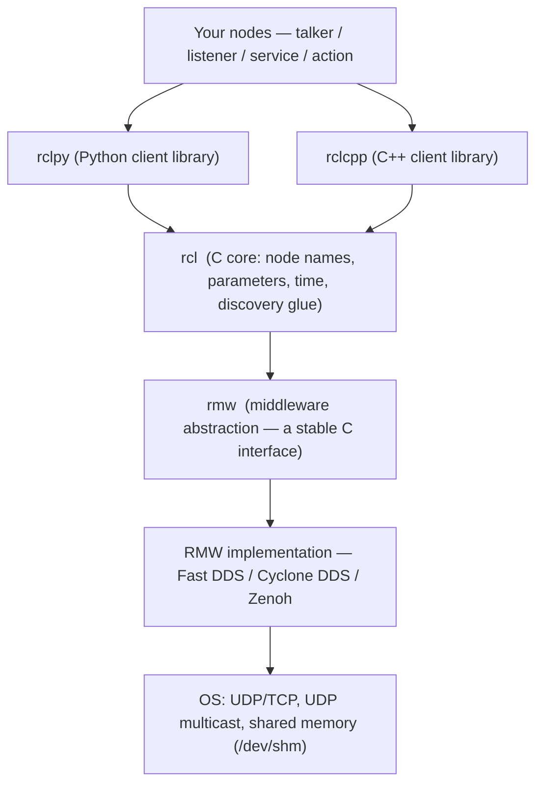

# 01 — ROS 2 architecture (the layer cake)

ROS 2 is not one program; it is a **stack of layers** with a stable interface between your
code and whatever middleware actually moves the bytes. For a firmware engineer the key idea
is: **the bottom layer is a swappable transport, exactly like a HAL.**

| Layer | What it is | Firmware analogy |
|---|---|---|
| `rclpy` / `rclcpp` | Language client libraries (Python, C++) | Your application + SDK |
| `rcl` | One C core: names, params, time, lifecycle | The common runtime/RTOS glue |
| `rmw` | A stable C **interface** middleware must implement | The **HAL header** |
| RMW impl | Fast DDS / Cyclone DDS / Zenoh | The **HAL driver** for a transport |
| OS net | UDP multicast, shared memory, loopback | The PHY / bus wires |

**Why this matters:** because `rclpy` and `rclcpp` sit on the *same* `rcl` core, a Python
talker and a C++ talker are first-class peers on the same topic — Demo 1 shows both publishing
`/chatter` at once. And because everything above `rmw` is implementation-agnostic, Demo 3 runs
the *same node binaries* over three middlewares by flipping one env var
(`RMW_IMPLEMENTATION`) — no recompile. That is the HAL swap, made real.

**There is no ROS master.** Unlike ROS 1's central `roscore`, ROS 2 nodes find each other by
**distributed discovery** (see [04-discovery](04-discovery.md)) — like devices enumerating
themselves on a shared bus rather than registering with a central controller.

See it live:
- `./run.sh demo-1` — pub/sub + service + action, Python and C++ on one graph.
- Captured graph: [`img/demo1_node_list.txt`](img/demo1_node_list.txt),
  [`img/demo1_chatter_info.txt`](img/demo1_chatter_info.txt).
