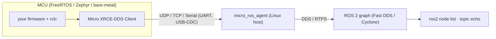

# 06 — micro-ROS on real MCUs (optional appendix)

> **Where ROS 2 meets your firmware.** This is the natural next step for an embedded team, but
> it is **not** part of the three core demos and is **not run in CI** — it is a docs+slide
> teaser. Facts below verified 2026-06-26.

## What it is

micro-ROS puts a ROS 2 client on resource-constrained MCUs. The MCU runs a lightweight
**XRCE Client**; a **`micro_ros_agent`** on a Linux host bridges it into DDS via the
**DDS-XRCE** protocol, so the MCU appears as an **ordinary ROS 2 node** (`ros2 node list`,
`ros2 topic echo` all work).

> **Gotcha:** run the **micro-ROS Agent** (it adds the ROS 2 Graph manager) — *not* the bare
> eProsima Micro XRCE-DDS Agent — or your MCU node won't show up in the graph.

## Transports
Built-in profiles are **UDP, TCP, and Serial (UART & USB-CDC)**, selected at **compile time**
via `RMW_UXRCE_TRANSPORT` (`udp` default | `serial` | `custom`). **CAN FD is a *custom*
transport** (Micro XRCE-DDS v2.1; Renesas RA reference) — not a drop-in fourth profile. Runtime
config only sets transport *parameters* (agent IP:port, serial device, or a user
open/close/write/read callback set via `rmw_uros_set_custom_transport`), not the profile *type*.

## Executor: `rclc` (C), not `rclcpp` (C++)
Same `rcl` core, lighter shell. Lead with **footprint** (C-only, no heavy C++ runtime/dynamic
allocation), then **determinism**: the `rclc` Executor offers user-defined static execution
order, conditional execution, trigger conditions, and Logical Execution Time — versus the
non-deterministic round-robin of the `rclcpp` Executor.

## Footprint (cite micro.ros.org)
**< 75 KB flash, ~3 KB RAM** for a full publisher+subscriber app at 512 B messages; ~**400 B per
publisher**, ~**500 B per subscriber** incremental; the Client is dynamic-memory-free at runtime.
**This is the *middleware* figure** — the whole firmware image also includes RTOS + `rcl`/`rclc`
+ network stack, so size real boards at **tens of KB RAM, ~256 KB+ flash** minimum.

## First boards & integration
- **ESP32** (cheapest, best-documented, Wi-Fi UDP) or **RP2040 / Pi Pico** (USB serial) to start.
- **Zephyr + STM32** or **Renesas EK-RA6M5** for the professional/reference path.
- RTOS: **FreeRTOS / Zephyr / NuttX / bare-metal** (micro-ROS is an official Zephyr module).
- Components: `micro_ros_arduino`, `micro_ros_espidf_component`, `micro_ros_stm32cubemx_utils`,
  `micro_ros_platformio`, `micro_ros_zephyr_module`.

## Version note
`micro_ros_setup` is released per-distro — for this Jazzy project use the **`jazzy` branch**
(`git checkout jazzy`). Live branches: humble/iron/jazzy/kilted/rolling; **Iron is EOL — avoid.**
