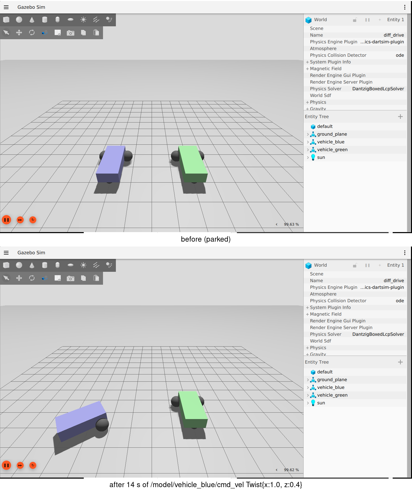
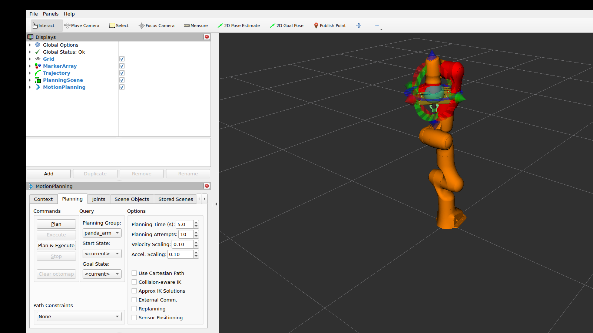

# ROS 2 Deep Dive — history, framework, ecosystem, and two runnable examples

*(July 2026. External claims are URL-sourced; 14 headline claims were independently
re-checked against primary sources — one correction came out of that audit and is noted
inline. Both demo screenshots at the end are real captures from runs on our machine.)*

**How to read this.** This is the ROS 2 companion to our stack-survey report: everything
about ROS 2 itself in one place — where it came from, how the framework actually works,
who maintains what, and two worked examples (a differential-drive vehicle in simulation
and a robot arm doing motion planning) that we ran and screenshotted ourselves.

---

## 1. History: from a Stanford lab to an industry standard

**The short version:** ROS was born at Willow Garage (founded late 2006 by Scott Hassan;
first ROS code repository November 2007), grew up strapped to the PR2 research robot
(commercially released September 2010), and outlived its parent — Willow Garage wound down
in 2013–2014, but not before creating the **Open Source Robotics Foundation (OSRF)** in
April 2012 to carry the project. *(Origin details are from secondary histories —
Wikipedia, ROS-Industrial — not a primary OSRF filing.)*

**Why ROS 2 exists at all.** ROS 1 assumed one robot, one roscore (a single point of
failure), a good network, no real-time, and a lab full of grad students. The primary
design document (design.ros2.org, "Why ROS 2?") lists the gaps that could not be fixed
in place: multi-robot systems, embedded/MCU participation, real-time control, degraded
networks, and production deployment (lifecycle, static configuration). The fix was a
rewrite on top of an off-the-shelf middleware standard — **DDS** — with no API
compatibility promised to ROS 1. The first ROS 2 release, **Ardent Apalone**, shipped
December 2017.

**The distro timeline that matters in 2026** (all dates re-verified against REP 2000 and
the official release pages):

| Distro | Released | LTS? | End of life |
|---|---|---|---|
| ROS 1 Noetic (the last ROS 1) | 2020 | — | **EOL May 31, 2025** — ROS 1 is over |
| Humble Hawksbill | May 2022 | LTS | May 2027 |
| Jazzy Jalisco ← *this repo* | May 2024 | LTS | May 2029 |
| Kilted Kaiju | May 2025 | no (1.5-year) | **November 2026** (audit correction: not December) |
| Lyrical Luth | May 22, 2026 | LTS | May 2031 |

The cadence is now: a new release every May; even years are 5-year LTS, odd years are
short-support. Practical consequence: **Kilted dies this November** — never pin a
teaching or product repo to an odd-year release. Jazzy (our pin) has three years left;
**Lyrical Luth is the new LTS** if starting fresh today (notable additions: the
`EventsCBGExecutor` as a first-class executor with an officially claimed 10–15% CPU
reduction [vendor-reported], YAML parameter type tags, buffer-typed `uint8[]` fields).

**Who runs ROS now.** Willow Garage → OSRF → a 2022 twist: **Intrinsic (Alphabet)
acquired OSRC**, the foundation's for-profit engineering arm (announced December 15,
2022) — the OSRF nonprofit stayed independent and kept the ROS/Gazebo/Open-RMF IP. To
put governance on a sustainable footing, OSRF launched the **Open Source Robotics
Alliance (OSRA)** in March 2024: a Linux-Foundation-style membership model with a
Technical Governance Committee and four Project Management Committees (ROS, Gazebo,
Open-RMF, Infrastructure). Platinum members: **Intrinsic, NVIDIA, Qualcomm**. That list
is worth a pause: the three biggest funders of "open" robot middleware are an Alphabet
company and two chip vendors.

**Is it alive?** By the project's own numbers (2025 ROS Metrics Report, published
February 2026 — self-reported, not independently audited): ~**1 billion package
downloads in 2025** (+85% YoY), **1.3 million unique download IPs** in October 2025
(+58% YoY), and **ROS 2 is now 91.2% of all downloads** — the ROS 1 → ROS 2 migration
argument is over. ROSCon 2025 was in Singapore; **ROSCon 2026 is in Toronto, September
22–24**, with regional editions in Paris and Edinburgh.

---

## 2. The framework: what is actually in the box

### 2.1. The layer cake

```
your node code (C++ / Python)
  rclcpp / rclpy        <- language client libraries
    rcl                 <- shared C core (names, time, graph, params)
      rmw               <- middleware abstraction (the swap point)
        Fast DDS (default) | Cyclone DDS | Connext | Zenoh
```

- **Fast DDS is the default RMW on Jazzy**; Cyclone and Connext are drop-in alternates
  (one env var: `RMW_IMPLEMENTATION`) — our repo's Demo 3 swaps them live and measures
  the interop matrix.
- **rmw_zenoh** — the first *non-DDS* RMW — reached **Tier-1 status in Kilted (May
  2025)**. On Jazzy it exists but without Tier-1 guarantees. Zenoh matters for exactly
  the cases DDS discovery hurts: WiFi, WAN links, large fleets.

### 2.2. The five concepts (all of ROS 2 is these)

| Concept | What it is | The firmware analogy |
|---|---|---|
| **Node** | one process (or component) on the graph | a device on the bus |
| **Topic** | typed, named pub/sub stream | a broadcast frame ID |
| **Service** | request/response call | a register read |
| **Action** | long-running goal + feedback + cancel | a command with progress IRQs |
| **Parameter** | per-node typed config, changeable at runtime | calibration registers |

Discovery is peer-to-peer (no master — the ROS 1 roscore is gone); `launch` files
(Python/XML/YAML) compose systems; **QoS profiles** (reliability, durability, history,
deadline, liveliness, lifespan) govern each topic contract — and an incompatible
pub/sub QoS pair does not degrade, it **does not connect** (it raises an incompatibility
event; our Demo 2 captures the full matrix for real in `docs/03-qos.md`).

### 2.3. Execution and composition (where CPU time goes)

- **Executors** own the callback loop: single-threaded (default), multi-threaded (+
  callback groups for concurrency control), and the newer events-based executors
  (backported into Jazzy; first-class `EventsCBGExecutor` in Lyrical).
- **Lifecycle (managed) nodes** add a state machine (unconfigured → inactive → active)
  — the production pattern for hardware-facing nodes: bring up in order, fail
  deterministically.
- **Composition** loads many nodes into one process; combined with **intra-process
  communication** it can skip serialization entirely — the answer to "isn't pub/sub
  slow?" is "in-process, it doesn't even serialize."

### 2.4. Build, packaging, platforms

`colcon` builds workspaces of `ament` packages; `package.xml` declares dependencies;
`rosdep` resolves them to system packages; overlay workspaces chain via
`source install/setup.bash`. Releases go through `bloom` + the ROS build farm into apt
repositories. Target platforms are pinned per-distro by **REP 2000** — for Jazzy,
Tier-1 = **Ubuntu 24.04 (amd64/arm64) and Windows 10**, with RHEL at Tier-2 — one
reason "it's Linux software" is only mostly true.

### 2.5. Tooling you actually touch daily

`ros2` CLI (topic/service/action/param/node/bag/doctor) · **rosbag2** recording with
**MCAP as the default format since Iron** (2023) · **RViz2** (3D state visualization) ·
**rqt** (plugin GUI: graph, plots, consoles) · **tf2** (the time-buffered transform
tree) · **URDF/xacro** (robot description — feeds robot_state_publisher, RViz, MoveIt,
Gazebo and ros2_control alike).

### 2.6. The hardware path (the part firmware engineers own)

- **ros2_control**: the `controller_manager` runs a read → update → write loop over
  plugin interfaces at a configured rate; your driver is a `hardware_interface` plugin;
  controllers (diff-drive, joint trajectory, PID…) are swappable in YAML. This is the
  framework our stack report covers in depth — and the arm/vehicle demos below both use
  its mock-hardware mode.
- **micro-ROS** puts a ROS 2 client on MCUs (FreeRTOS, Zephyr, NuttX) over
  **Micro XRCE-DDS**; a host-side **agent** bridges to the DDS graph. Teaching trap:
  the agent does *not* run on the MCU — only the client does.
- **SROS2** wraps DDS-Security (authentication, access control, encryption) with a CLI
  that generates keystores and permission files; it is opt-in, not default — whether
  production fleets actually enable it is not publicly quantified [UNVERIFIED].

---

## 3. Community, repos, and who maintains what

### 3.1. The org map (GitHub, activity re-checked 2026-07)

| Org | Flagships | Purpose | License |
|---|---|---|---|
| **ros2** | rclcpp, rclpy, rcl, rmw, demos, sros2 | the core | Apache-2.0 |
| **ros-controls** | ros2_control, ros2_controllers, demos | hardware + controllers | Apache-2.0 |
| **ros-navigation** | navigation2 (Nav2, ~4.5k★) | mobile-robot autonomy | BSD-3 |
| **moveit** | moveit2 (~1.9k★), moveit_resources | manipulation planning | BSD-3 |
| **ros-perception** | image_pipeline, vision_opencv, perception_pcl | perception middleware | BSD/Apache mix |
| **gazebosim** | gz-sim (Harmonic), ros_gz | simulation + bridge | Apache-2.0 |
| **micro-ROS** | micro_ros_agent, client libs | MCU-side ROS 2 | Apache-2.0 |
| **SteveMacenski** | slam_toolbox (~2.5k★, v2.8.5 Apr 2026) | 2D lifelong SLAM | LGPL-2.1 |

Maintenance reality behind the flagships: **Nav2** is led by Open Navigation LLC (with
NVIDIA/AMD/others as self-listed sponsors); **MoveIt 2** is stewarded by PickNik
Robotics, which sells the commercial **MoveIt Pro** on top; **ros2_control** is
community-maintained under ros-controls with active CI across Humble/Jazzy/Kilted.
That pattern — a small company anchoring each flagship, funded by support contracts —
is how ROS 2's "free" stack is actually paid for.

### 3.2. Community channels

**ROS Discourse** (announcements, working groups — the place release news lands) ·
**Robotics Stack Exchange** (Q&A) · **REPs** (the RFC process; REP 2000 = platforms) ·
active working groups in 2026 include **real-time** (github.com/ros-realtime) and
**safety** (github.com/ros-safety) · **ROS-Industrial** runs three regional consortia
(SwRI Americas / Fraunhofer IPA Europe / A*ARTC Asia-Pacific) for factory adoption ·
the **Gazebo pairing rule**: every ROS release pins a Gazebo release — **Jazzy ↔
Harmonic** — mixing pairings is the #1 simulation setup mistake.

### 3.3. Licensing

Everything above is Apache-2.0/BSD/LGPL — no CLA walls, no gated weights, no paid
tiers for the core. (The contrast with the NVIDIA stack in our other report is the
point: ROS 2 is the *shared substrate*; differentiation happens above it.)

---

## 4. Example A — a wheeled vehicle in simulation (run for real)

*(Section written against our actual run — see the capture details and screenshot
below. Environment: the repo's pinned `ros:jazzy` container + `ros-jazzy-ros-gz`,
software rendering, headless X.)*

The official Jazzy wheeled-robot "hello world" is the **`ros_gz_sim_demos` diff-drive
demo**: a Gazebo Harmonic world with two differential-drive vehicles, bridged to ROS 2.

```bash
apt install ros-jazzy-ros-gz          # Gazebo Harmonic + the ros_gz bridge
ros2 launch ros_gz_sim_demos diff_drive.launch.py
# note: the Jazzy binary ships a .launch.py — the .launch.xml name seen in the
# ros2 branch docs is not what the released package installs
```

What the launch starts: `gz sim` (server + GUI) with `diff_drive.sdf`, plus a
**parameter_bridge** already configured (in `config/diff_drive.yaml`) to map
`/model/vehicle_blue/cmd_vel` (ROS `geometry_msgs/msg/Twist`) → `gz.msgs.Twist`.
Driving it is one command:

```bash
ros2 topic pub -r 10 /model/vehicle_blue/cmd_vel geometry_msgs/msg/Twist \
  '{linear: {x: 1.0}, angular: {z: 0.4}}'
```



*Real capture from our run: the blue vehicle traces an arc after ~14 s of the Twist
command above (1.0 m/s forward, 0.4 rad/s yaw). The odometry flows back over the same
bridge as `/model/vehicle_blue/odometry`.*

**Why this demo is the right mental model:** the robot in the world is pure SDF + a
`DiffDrive` *system plugin* — Gazebo is doing what firmware + motor drivers do on a
real robot. ROS 2 only sees topics. Swap the simulated vehicle for a real base running
`ros2_control` + `diff_drive_controller` and *the `cmd_vel` interface is identical* —
that is the entire porting story sim → real, and it is why Nav2 doesn't care which one
it is driving. (Next steps on this path: `ros2_control_demo_example_2` — DiffBot — then
Nav2 + slam_toolbox, both covered in our stack report.)

## 5. Example B — a robot arm with motion planning (run for real)

The canonical arm demo on Jazzy is **MoveIt 2** (binaries: `ros-jazzy-moveit`, MoveIt
2.10 LTS) with the classic **Panda** configuration:

```bash
apt install ros-jazzy-moveit ros-jazzy-moveit-resources-panda-moveit-config
ros2 launch moveit_resources_panda_moveit_config demo.launch.py
```

What that one launch actually assembles — worth reading as an architecture diagram:

1. `robot_state_publisher` — URDF → TF tree
2. **ros2_control** with *mock hardware* — the same controller stack a real arm would
   use (`joint_trajectory_controller` + `joint_state_broadcaster`), minus the motors
3. `move_group` — MoveIt's planning node: OMPL planners + collision checking (FCL)
   against the URDF/SRDF
4. RViz2 with the **MotionPlanning** display — drag the interactive marker to a goal
   pose, **Plan**, **Execute**



*Real capture from our run: RViz2 showing the 7-DoF Panda with the MotionPlanning
panel. The orange arm is the goal state; Plan generates a collision-free joint
trajectory, Execute feeds it to the (mock) ros2_control stack.*

**The teaching point for our team:** the *only* difference between this demo and a real
arm is the `hardware_interface` plugin under ros2_control — mock components vs your
CAN/EtherCAT driver. Planning (`move_group`), kinematics, RViz, controllers: unchanged.
The MoveIt tutorials' flagship quickstart has moved to the Kinova Gen3 on recent
branches, but the Panda resources package remains the released, self-contained Jazzy
demo (that's why we use it here).

Programmatic use is one class away — C++ `MoveGroupInterface` (or Python
`moveit.planning`): set a pose target, `plan()`, `execute()` — that's the whole API
surface a pick-and-place task needs to start.

## 6. Bonus pointers (the next demos to steal)

- **ros2_control_demos** (github.com/ros-controls/ros2_control_demos, Jazzy docs on
  control.ros.org): `example_1` = RRBot, a 2-joint arm; `example_2` = DiffBot, a
  diff-drive base — the minimal-code versions of examples A/B with *your own* hardware
  plugin, and step 1 of our repo roadmap.
- **urdf_tutorial**: `ros2 launch urdf_tutorial display.launch.py model:=...` — URDF →
  RViz with joint sliders; the fastest way to see a robot description.
- **Sensors in sim**: gz-sim ships lidar/camera/IMU worlds; the same
  `ros_gz_bridge` pattern exposes them as `sensor_msgs` topics.

---

## 7. What we verified, and what to watch

- **Audit result for this report: 13/14 headline claims confirmed, 1 corrected** —
  Kilted Kaiju's EOL is **November 2026** (REP 2000), not December as several trackers
  say. Full claim-by-claim trail: `research/claims-audit-2026-07.md` (ROS 2 deep-dive
  section).
- One discrepancy we caught **by running, not reading**: the Jazzy-released
  `ros_gz_sim_demos` ships `diff_drive.launch.py`, while the upstream `ros2` branch
  README shows `diff_drive.launch.xml` — pin to the distro branch, not `main`, when
  scripting demos.
- **Distro guidance for this repo:** stay on Jazzy (EOL 2029) for now; revisit
  **Lyrical Luth** (EOL 2031) once its ecosystem catches up — flagships like MoveIt and
  Nav2 typically take months to promote a new LTS to first-class support.
- Numbers to treat as self-reported: ROS metrics (downloads/IPs), Nav2/MoveIt adopter
  lists, GitHub stars (fetched 2026-07, they drift).

## 8. References

**History & governance** · design.ros2.org/articles/why_ros2.html ·
docs.ros.org/en/rolling/Releases.html (REP 2000: raw at
github.com/ros-infrastructure/rep) · openrobotics.org blog (Ardent 2017-12; Intrinsic
acquisition 2022-12-15; OSRA 2024-03-18; Kilted 2025-05-23) · discourse.openrobotics.org
(Noetic EOL 43160; Lyrical Luth 55021; 2025 Metrics Report 52575) · osralliance.org ·
roscon.ros.org/2026

**Framework** · docs.ros.org/en/jazzy (concepts, QoS, executors, RMW implementations)
· design.ros2.org (intraprocess, realtime, node lifecycle, DDS security) ·
control.ros.org/jazzy · micro.ros.org · github.com/ros2/sros2 · REP 2000 ·
discourse.openrobotics.org (MCAP default in Iron, 28489)

**Ecosystem** · github.com/ros2 · github.com/ros-controls · github.com/ros-navigation ·
github.com/moveit · github.com/gazebosim/ros_gz · github.com/SteveMacenski/slam_toolbox
· github.com/ros-realtime · github.com/ros-safety · rosindustrial.org · picknik.ai
(MoveIt Pro; Jazzy LTS release post 2024-06-30) · metrics.ros.org

**Examples** · gazebosim.org/docs/harmonic/ros2_integration ·
github.com/gazebosim/ros_gz (ros_gz_sim_demos, config/diff_drive.yaml) ·
moveit.picknik.ai (tutorials) · github.com/moveit/moveit_resources ·
control.ros.org/jazzy/doc/ros2_control_demos

*Screenshots (`docs/img/ros2_gz_diffdrive.png`, `docs/img/ros2_moveit_panda.png`) are
our own captures, July 2026, from the repo's pinned Jazzy container with
`ros-jazzy-ros-gz` and `ros-jazzy-moveit` installed on top; headless X (Xvfb) with
software rendering.*
